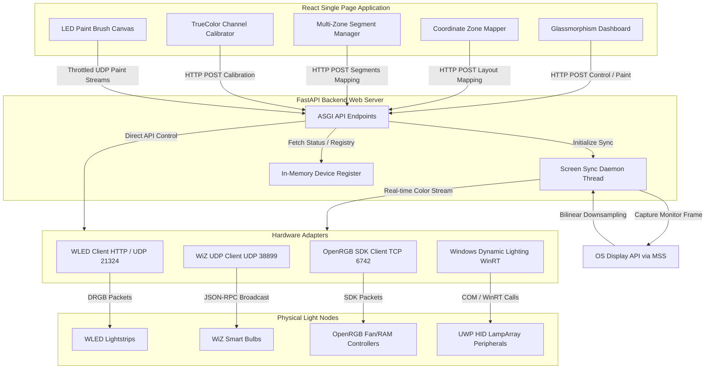

# SpectraStrike Hub - Enterprise Unified Gaming & Ambient Sync Control Plane

> **A futuristic, glassmorphic smart lighting hub for unified control of WLED, WiZ, OpenRGB, and Windows Dynamic Lighting devices with real-time screen synchronization.**

SpectraStrike Hub is a unified, high-performance, and low-latency smart lighting control hub and synchronization service. It aggregates diverse local IoT protocols—**WLED controllers (HTTP/UDP)**, **Philips WiZ bulbs (UDP JSON-RPC)**, **OpenRGB SDK servers (TCP)**, and **Windows Dynamic Lighting (UWP WinRT LampArray)**—into a single, responsive control plane optimized for immersive gaming environments.

Designed for real-time applications, SpectraStrike Hub includes a **SignalRGB-style pixel painting grid** for granular lightstrip control, an **interactive screen ambient sync (Ambilight) mapping canvas** supporting HTML5 drag-and-drop assigning, **Multi-Zone LED Segment Sync**, **TrueColor Manual Channel Calibration**, and a fully-compliant **Model Context Protocol (MCP) server** for AI agent orchestration.

---

## 📋 Table of Contents

- [Quick Start](#quick-start)
- [Features](#features)
- [System Architecture](#system-architecture--data-flow)
- [Technical Deep-Dives](#technical-deep-dives)
- [API Reference](#api-endpoint-reference)
- [Project Structure](#project-directory-structure)
- [Troubleshooting](#troubleshooting)
- [Contributing](#contributing)
- [Security](#security)
- [License](#license)

---

## Quick Start

### Prerequisites

- **Python 3.9+** (Windows/macOS/Linux)
- **Node.js 18+** and **npm 9+**
- **Git**
- Smart lighting devices: WLED, WiZ, OpenRGB, or Windows Dynamic Lighting

### Installation & Running (5 minutes)

**1. Clone & Setup Backend:**
```bash
git clone https://github.com/AyushSharma297/SpectraStrike-Hub.git
cd SpectraStrike-Hub/backend
pip install -r requirements.txt
python main.py
```
Backend runs on `http://localhost:8000` (FastAPI with auto-docs at `/docs`)

**2. Setup Frontend (new terminal):**
```bash
cd frontend
npm install
npm run dev
```
Frontend runs on `http://localhost:5173`

**3. Start using:**
- Open your browser to `http://localhost:5173`
- Click **"Scan Devices"** to auto-discover local lighting controllers
- Control brightness, colors, effects, and screen sync from the dashboard

### Demo Features

Once running, try these:
- **Color Palette Generator**: Create harmonious 5-color schemes with 6 harmony modes
- **Scenes**: Snapshot and restore device states instantly
- **Groups**: Organize devices and control them together
- **Schedules**: Set daily automation rules
- **Live Stats**: Monitor device count, LED total, sync FPS, uptime

**GitHub Repository**: [github.com/AyushSharma297/SpectraStrike-Hub](https://github.com/AyushSharma297/SpectraStrike-Hub)

---

## Features

SpectraStrike Hub includes these production-ready features:

### Core Control
- ✅ **Multi-Protocol Support**: WLED, WiZ, OpenRGB, Windows Dynamic Lighting
- ✅ **Device Auto-Discovery**: Fast local subnet scanning with validation
- ✅ **Real-Time Control**: Instant power, brightness, color, and effect changes
- ✅ **Group Management**: Create device groups with rename, color, brightness, effect control
- ✅ **Scenes & Presets**: Capture and apply device state snapshots

### Advanced Sync & Ambient
- ✅ **Screen Ambient Sync (Ambilight)**: Real-time edge/zone color mapping from screen capture
- ✅ **Multi-Zone Segments**: Split lightstrips into independent screen regions
- ✅ **Interactive Canvas Mapping**: Drag-and-drop coordinate zone assignment
- ✅ **Bilinear Downsampling**: Hardware-optimized color averaging

### Color & Calibration
- ✅ **TrueColor Manual Calibration**: 3x3 matrix correction for hardware color tints
- ✅ **Color Picker with Presets**: Quick access to common colors
- ✅ **Palette Generator**: 6 color harmony schemes (Complementary, Triad, etc.)
- ✅ **Live Paint Brush**: Pixel-level LED control with 75ms network throttle

### Automation & Integration
- ✅ **Schedules & Automation**: Daily rules with day-of-week + time + action targeting
- ✅ **Model Context Protocol (MCP)**: AI-ready integration (Claude, Gemini, Cursor)
- ✅ **FastAPI REST API**: Full endpoint coverage with auto-generated docs

### UI/UX
- ✅ **Glassmorphic Design**: Modern frosted-glass aesthetic with animations
- ✅ **Real-Time Dashboard**: Live stats (device count, LEDs, sync FPS, uptime)
- ✅ **Responsive Layouts**: Works on desktop and mobile

---

## System Architecture & Data Flow

SpectraStrike Hub separates concerns between a reactive SPA frontend, a multithreaded FastAPI orchestrator, and low-latency network adapters.

### System Topology Diagram



---

## 2. Technical Deep-Dives

### 2.1 How Screen Capture Ambient Sync Works
The real-time ambient lighting synchronization loop is executed within a dedicated background worker thread (`ScreenSyncWorker` in [screen_sync.py](file:///C:/Users/aayus/.gemini/antigravity-ide/scratch/wled-wiz-hub/backend/screen_sync.py)) to prevent blocking the main FastAPI web thread.

```text
+------------------+     +-----------------------+     +--------------------+     +-------------------+
|  Screen Capture  |     |   Coordinate Crop     |     |   Downsampling     |     |  Network Stream   |
|   (MSS API)      | --> |  (Left/Top/Right/etc) | --> | (Bilinear 1x1/32x32| --> |  (DRGB UDP / WDL) |
+------------------+     +-----------------------+     +--------------------+     +-------------------+
```

#### Step 1: High-Performance Screen Capture
Traditional screen capture methods (e.g. PIL `ImageGrab`) carry substantial CPU overhead and latency. SpectraStrike Hub utilizes the **`mss` (Multiple Screen Shot)** library. On Windows, `mss` directly interfaces with the OS display driver using the **Desktop Duplication API (DXGI)**. This fetches the display buffer directly from GPU memory in raw pixel format, bypassing OS window composition bottlenecks.

#### Step 2: Image Conversion
The raw pixel buffer is captured in `BGRA` layout. We instantiate a Pillow `Image` object in memory using:
```python
img = Image.frombytes("RGB", sct_img.size, sct_img.bgra, "raw", "BGRX")
```
This is a zero-copy memory operation that strips the alpha channel and converts BGR to RGB structure in less than 2 milliseconds.

#### Step 3: Coordinate Zone Cropping & Segments
To support multi-zone ambient lighting, the screen is cropped based on the user's coordinate mapping:
* **Left Zone**: Crops the left 15% width of the frame: `img.crop((0, 0, int(w * 0.15), h))`
* **Right Zone**: Crops the right 15% width: `img.crop((int(w * 0.85), 0, w, h))`
* **Top Zone**: Crops the top 15% height: `img.crop((0, 0, w, int(h * 0.15)))`
* **Bottom Zone**: Crops the bottom 15% height: `img.crop((0, int(h * 0.85), w, h))`
* **Center Zone**: Crops the central 50% box: `img.crop((int(w * 0.25), int(h * 0.25), int(w * 0.75), int(h * 0.75))`

#### Step 4: Bilinear Downsampling
Calculating average colors by iterating over millions of pixels is CPU-bound and inefficient. Instead, SpectraStrike Hub uses bilinear downsampling:
1. To obtain a single average color for a zone (e.g., for WiZ Bulbs, OpenRGB, or Windows Dynamic Lighting), we resize the cropped zone down to a **1x1 pixel**:
   ```python
   img_tiny = cropped.resize((1, 1), Image.Resampling.BILINEAR)
   r, g, b = img_tiny.getpixel((0, 0))
   ```
   Bilinear interpolation automatically calculates the weighted average color of the entire image during the resizing operation at hardware speed.
2. For WLED Ambilight border arrays, we downsample the cropped border zone to a **32x32 grid**, then trace along the corresponding edge path to sample colors for each individual LED index.

#### Step 5: WLED Multi-Zone Segment Mapping
When Multi-Zone LED Segment Sync is active, a single WLED controller's lightstrip is split into index-level segments (e.g., LEDs 0 to 15 mapped to the Left zone, and LEDs 15 to 30 mapped to the Top zone).
* During the thread run, the sync worker initializes a black bytearray representing `led_count * 3`.
* For each segment, the worker crops the corresponding screen region, averages or samples the colors, and overlays them only within the indices specified by the segment (`start` to `end`).
* The unified payload is merged and dispatched inside a single UDP packet payload, preserving network bandwidth and lowering driver-side overhead.

#### Step 6: Streaming over Network Protocols
Once colors are computed, they are sent immediately to their respective hardware drivers over low-overhead UDP sockets or direct WinRT COM APIs.

---

### 2.2 TrueColor Manual Channel Calibration

Cheaper LEDs, physical diffusion, and bulb casings often introduce color tints (e.g., pure Red looking slightly orange because of green bleed, or pure White looking too warm/yellow). SpectraStrike Hub resolves this by implementing a **TrueColor Manual Channel Calibration** system using 3x3 linear matrix transformations:

1. **User input calibration**: The user commands the device to output pure Red `[255, 0, 0]`, pure Green `[0, 255, 0]`, and pure Blue `[0, 0, 255]`. They inspect the light output physically and select the color they *actually perceive* (the "seen" colors).
2. **Matrix Formulation**: The normalized perceived colors form the columns of a 3x3 color-distortion matrix $M$:
   $$M = \begin{bmatrix} R_{seen\_red}/255 & G_{seen\_red}/255 & B_{seen\_red}/255 \\ R_{seen\_green}/255 & G_{seen\_green}/255 & B_{seen\_green}/255 \\ R_{seen\_blue}/255 & G_{seen\_blue}/255 & B_{seen\_blue}/255 \end{bmatrix}$$
3. **Inverse Matrix Calculation**: The backend FastAPI server computes the matrix inverse $M^{-1}$. If $M$ is singular or unstable, it falls back to the Identity matrix.
4. **On-the-Fly Correction**: All outgoing colors $C = [R, G, B]^T$ (whether from static color sliders, WLED live paint brushes, or real-time screen capture sync frames) are multiplied by the inverse matrix before packet transmission:
   $$C_{calibrated} = \text{clip}_{0}^{255}(M^{-1} \times C)$$
   This neutralizes hardware-specific channel crosstalk and color shifts, ensuring high-fidelity ambient lighting.

---

### 2.3 Device Interfacing Protocols

#### WLED JSON API & UDP Realtime Stream
WLED devices are controlled via two distinct interfaces depending on the operation:
1. **Control Commands (HTTP)**: Setting brightness, power state, and animations uses HTTP POST requests to `http://<ip>/json/state` carrying a JSON payload:
   ```json
   {
     "on": true,
     "bri": 128,
     "seg": [{"fx": 9, "sx": 128, "ix": 128}]
   }
   ```
2. **Real-time Live Paint & Sync (UDP)**: Sending pixel frames at high speed uses the **DRGB Realtime protocol** on UDP Port `21324`. This avoids HTTP connection negotiation overhead. The binary packet structure is defined as:
   * **Byte 0**: Protocol Type (Value: `2` representing DRGB).
   * **Byte 1**: Timeout in seconds before WLED reverts to its previous solid color or animation (Value: `2`).
   * **Byte 2+**: Sequential RGB values for every LED: `[R0, G0, B0, R1, G1, B1, ...]`

#### Philips WiZ UDP JSON-RPC
Philips WiZ bulbs communicate locally over **UDP Port `38899`** using a JSON-RPC-based protocol. This is stateless and does not require persistent TCP handshakes:
1. **Setting Bulb Color/Power**:
   * Destination: `UDP <bulb_ip>:38899`
   * Payload:
     ```json
     {"method": "setPilot", "params": {"state": true, "r": 255, "g": 0, "b": 128}}
     ```
2. **Querying State**:
   * Payload:
     ```json
     {"method": "getPilot", "params": {}}
     ```
   * The bulb returns the current power state, dimming percentage, and RGB/Kelvin temperature.

#### OpenRGB SDK Protocol
OpenRGB devices (motherboards, RAM modules, graphics cards, peripherals) are controlled by connecting via a TCP socket to a local **OpenRGB Server on Port `6742`**. The `openrgb-python` SDK wraps the binary TCP protocol, allowing SpectraStrike Hub to query the device list and issue color packets directly to specific hardware zones.

#### Windows Dynamic Lighting (UWP WinRT)
On Windows 11, HID-compliant lighting devices (keyboards, motherboards, mouse arrays) are managed natively by the OS. SpectraStrike Hub controls these by loading the Windows Runtime (WinRT) metadata library (`winsdk`):
1. **Device Discovery**:
   We query the system for devices implementing the HID LampArray contract using:
   ```python
   selector = LampArray.get_device_selector()
   devices = await DeviceInformation.find_all_async(selector)
   ```
2. **Color Updates**:
   For each connected `LampArray`, we apply RGB colors scaled by the client's master brightness using:
   ```python
   c = Color()
   c.r, c.g, c.b, c.a = r, g, b, 255
   lamp_array.set_all_colors(c)
   ```
   *Note: Ensure "Background Light Control" is enabled in Windows Settings -> Personalization -> Dynamic Lighting to allow control when the application window is minimized.*

---

## 3. Network Subnet Scan Optimization

Subnet scanning checks all IPs in the local subnets for responsive lighting controllers. To complete this quickly without blocking the server:
1. **IP Subnet Identification**: We query active IP configurations on the host, filter out VPN interfaces (like Radmin or Hamachi) using RFC 1918 private subnet checks (`192.168.0.0/16`, `10.0.0.0/8`, `172.16.0.0/12`), and extract local `/24` subnet prefixes.
2. **Asynchronous Port Scanning**: Using Python's `asyncio.open_connection`, we trigger 254 simultaneous socket checks on port 80 (WLED) and send WiZ UDP search queries concurrently.
3. **Timeout Thresholds**: Connection timeouts are capped at **0.4 seconds**. Because the scan is fully asynchronous, scanning a complete `/24` class-C subnet takes under 1 second.
4. **Validation Handshake**: If port 80 is open, the scanner issues a fast HTTP GET to `/json/info`. Only devices returning a valid WLED schema are registered.
5. **WiZ Broadcast sweeps**: Uses direct UDP broadcast to `255.255.255.255` and local broadcast borders (e.g. `192.168.1.255`), followed by a high-speed unicast sweep to bypass router-level client isolation.

---

## 4. UI Performance & Client-Side Throttling

When drawing on the **LED Paint Brush** grid in the React interface, clicking and dragging triggers mouse-move events at a high frequency (often 100+ events per second). 

Sending an HTTP or UDP packet for every pixel change would saturate the browser network queue and flood the backend. 

To solve this, SpectraStrike Hub uses a **Client-Side Stream Throttle**:
1. When drawing, color changes are saved instantly to a local React state array (`ledColors`) to keep the visual drawing grid highly responsive (60+ FPS).
2. A background polling timer runs in the React application at a fixed interval of **75ms** (approximately **14 FPS**):
   ```javascript
   useEffect(() => {
     const streamInterval = setInterval(() => {
       if (paintDirtyRef.current && selectedDeviceId) {
         streamPaintColors(selectedDeviceId, ledColorsRef.current);
         paintDirtyRef.current = false;
       }
     }, 75);
     return () => clearInterval(streamInterval);
   }, [selectedDeviceId]);
   ```
3. If the grid was modified during that 75ms window (`paintDirtyRef.current == true`), a single batch payload containing the entire lightstrip pixel configuration is sent to the backend. This balances UI responsiveness with low network load.

---

## 5. Model Context Protocol (MCP) Integration Setup

SpectraStrike Hub exposes its features via a stdio-based Model Context Protocol server, allowing LLM interfaces to query, inspect, and control local lights.

### 5.1 Claude Desktop Integration
1. Locate your Claude Desktop configuration file on Windows:
   `%APPDATA%\Claude\claude_desktop_config.json`
2. Configure the `spectrastrike-hub` entry under `mcpServers`:
   ```json
   {
     "mcpServers": {
       "spectrastrike-hub": {
         "command": "python",
         "args": [
           "C:/Users/aayus/.gemini/antigravity-ide/scratch/wled-wiz-hub/backend/mcp_server.py"
         ]
       }
     }
   }
   ```
3. Restart Claude Desktop. You can now command Claude to interact with your lights.

### 5.2 Gemini / Antigravity Setup
For Gemini-based agents, register the MCP server with the following properties:
* **Server ID**: `spectrastrike-hub`
* **Transport**: `stdio`
* **Command**: `python`
* **Arguments**: `["C:/Users/aayus/.gemini/antigravity-ide/scratch/wled-wiz-hub/backend/mcp_server.py"]`

### 5.3 Generic MCP Clients (Cursor, Zed)
* **Cursor**: Add in `Settings` -> `Features` -> `MCP` as a `command` type server:
  ```bash
  python C:/Users/aayus/.gemini/antigravity-ide/scratch/wled-wiz-hub/backend/mcp_server.py
  ```
* **Zed Editor**: In `settings.json`:
  ```json
  "context_servers": {
    "spectrastrike-hub": {
      "command": "python",
      "args": ["C:/Users/aayus/.gemini/antigravity-ide/scratch/wled-wiz-hub/backend/mcp_server.py"]
    }
  }
  ```

---

## 6. API Endpoint Reference

The backend FastAPI web server runs on Port **8000** and exposes the following REST interface:

### 6.1 `GET /api/devices`
Retrieves a list of all active registered controllers and their cached runtime configurations.

### 6.2 `POST /api/scan`
Triggers an asynchronous scan of active local subnets. Returns list of newly-registered physical hardware nodes.

### 6.3 `POST /api/devices/add`
Force-registers a device at a specific IP address (useful for offline devices).

### 6.4 `POST /api/devices/{device_id}/control`
Applies immediate changes (power, brightness, solid colors, and presets) to a device.

### 6.5 `POST /api/devices/{device_id}/paint`
Receives live color grids for individual LEDs on a WLED lightstrip, streaming them over UDP.

### 6.6 `POST /api/devices/{device_id}/calibration`
Applies manual color calibration matrix values for a specific lighting node.
* **Request Schema**:
  ```json
  {
    "r_seen": [255, 10, 0],
    "g_seen": [0, 255, 5],
    "b_seen": [0, 15, 255]
  }
  ```

### 6.7 `GET /api/devices/{device_id}/calibration`
Retrieves the saved perceived calibration color values for a device.

### 6.8 `POST /api/sync/layout`
Saves screen coordinates region assignments to devices.

### 6.9 `POST /api/sync/segments`
Saves index-level screen coordinate region assignments for WLED lightstrips.

### 6.10 `GET /api/sync/segments`
Retrieves all registered segment mappings.

### 6.11 `POST /api/sync/screen`
Controls the screen ambient sync thread worker.

---

## 7. Project Directory Structure

The repository follows a clean monorepo structure separating the Python ASGI backend from the Vite React SPA frontend:

```text
wled-wiz-hub/
├── .gitignore              # Root-level Git ignore configuration
├── LICENSE                 # Apache 2.0 License
├── README.md               # This documentation
├── CONTRIBUTING.md         # Contributing guidelines and dev setup
├── SECURITY.md             # Security policy and vulnerability disclosure
├── CODE_OF_CONDUCT.md      # Community standards and behavior expectations
├── run.bat                 # Windows orchestrator startup utility script
├── backend/                # FastAPI Application Backend
│   ├── main.py             # FastAPI App, router, device cache setup
│   ├── mcp_server.py       # Model Context Protocol (MCP) server endpoints
│   ├── scanner.py          # Multicast SSDP device finder (UDP & TCP ports)
│   ├── screen_sync.py      # Background capture thread and buffer processor
│   ├── wled.py             # WLED Client wrapper (HTTP JSON & UDP DRGB)
│   ├── wiz.py              # WiZ Client wrapper (Raw socket UDP JSON-RPC)
│   ├── pc_lights.py        # OpenRGB TCP SDK connection library
│   ├── windows_dynamic_lighting.py # Windows Dynamic Lighting client (WinRT integration)
│   └── requirements.txt    # Python backend module list
└── frontend/               # Vite React Dashboard App
    ├── package.json        # Node configuration and script runners
    ├── vite.config.js      # Vite build configurations
    ├── eslint.config.js    # Code styling validation rules
    ├── index.html          # Web entry point index file
    ├── public/             # Static vectors and icons
    └── src/                # Frontend codebase
        ├── main.jsx        # App component mounter
        ├── App.jsx         # Dashboard SPA client UI code (2700+ lines)
        ├── index.css       # Core gamer glassmorphism design system (1000+ lines)
        └── assets/         # Component icons
```

---

## Troubleshooting

### Backend won't start
- **Error**: `ModuleNotFoundError: No module named 'fastapi'`
  - **Solution**: Run `pip install -r requirements.txt` in the `backend/` folder
- **Error**: `Port 8000 already in use`
  - **Solution**: Change the port in `main.py` or kill the process using port 8000

### Devices not appearing in scan
- **Check**: Devices must be on the same local network (WiFi/Ethernet)
- **Check**: Firewall may be blocking UDP ports 38899 (WiZ) or 21324 (WLED)
- **Try**: Manual device add via `POST /api/devices/add` with device IP

### Screen sync not working
- **Windows**: Ensure "Background Light Control" is enabled in Settings → Personalization → Dynamic Lighting
- **MSS library**: Make sure `mss` library installed: `pip install mss`
- **Check**: Verify devices support screen sync (WLED, OpenRGB support this; WiZ bulbs use color averaging)

### Frontend build warnings
- **Solution**: Run `npm run build` to identify issues. The build should complete with zero errors/warnings

### Color not matching expected
- **Solution**: Use **TrueColor Manual Calibration**:
  1. Set device to pure Red [255,0,0], Green [0,255,0], Blue [0,0,255]
  2. Note the perceived colors visually
  3. Use the calibration endpoint to correct the color matrix

---

## Contributing

We welcome contributions! Please see [CONTRIBUTING.md](CONTRIBUTING.md) for:
- Development setup instructions
- Code style guidelines
- Pull request process
- Feature development checklist

**Quick PR Checklist:**
- [ ] Fork the repository
- [ ] Create a feature branch: `git checkout -b feature/your-feature`
- [ ] Make changes and test locally
- [ ] Verify: `npm run build` (zero warnings) and backend starts correctly
- [ ] Commit with conventional message: `feat: your feature description`
- [ ] Push and open a pull request

---

## Security

To report security vulnerabilities, please see [SECURITY.md](SECURITY.md).

**Do not** create public issues for security problems. Instead:
- Email the maintainers with vulnerability details
- Allow time for a patch before public disclosure
- Follow the 90-day responsible disclosure window

---

## License

SpectraStrike Hub is released under the **Apache License 2.0**.

You are free to:
- ✅ Use this software for any purpose (commercial or personal)
- ✅ Modify and distribute the code
- ✅ Include it in your projects

You must:
- 📋 Include the original license and copyright notice
- 📋 Disclose any modifications made
- ⚠️ Provide a copy of the Apache 2.0 license with distributions

See [LICENSE](LICENSE) for full terms.

**Copyright © 2026 SpectraStrike Hub Contributors**

---

## Technical Compliance Notes

### WiZ Socket Integration
The WiZ light control engine in SpectraStrike Hub ([backend/wiz.py](backend/wiz.py)) is implemented using low-level sockets communicating via the open local JSON-RPC protocol over UDP Port 38899. 
- **Zero Proprietary SDKs**: Uses only built-in Python sockets
- **No Reverse-Engineering**: Uses publicly documented JSON-RPC methods (`getPilot`, `setPilot`)
- **Fully Legal**: No encrypted keys, proprietary binaries, or firmware blobs stored

### Stack
- **Backend**: Python 3.9+ with FastAPI, Uvicorn
- **Frontend**: React 19 with Vite, Lucide icons, custom glassmorphic CSS
- **Styling**: 1000+ lines of modern glassmorphism with animations
- **Protocols**: WLED (HTTP/UDP), WiZ (UDP JSON-RPC), OpenRGB (TCP), Windows Dynamic Lighting (WinRT)

---

## Support & Questions

- 📖 **Documentation**: See [CONTRIBUTING.md](CONTRIBUTING.md) for dev guides
- 🐛 **Bug Reports**: [Open an issue](https://github.com/AyushSharma297/SpectraStrike-Hub/issues) with reproduction steps
- 💡 **Feature Requests**: [Open an issue](https://github.com/AyushSharma297/SpectraStrike-Hub/issues) describing the use case
- 💬 **Discussions**: [GitHub Discussions](https://github.com/AyushSharma297/SpectraStrike-Hub/discussions) for general questions
- 📧 **Email**: ayushsh762@gmail.com
